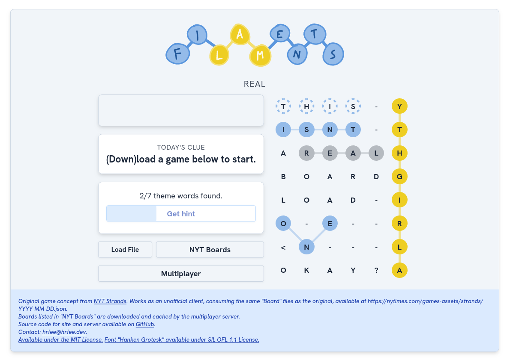

# "filaments"



Re-implementation of the [NYT Strands](https://www.nytimes.com/games/strands) game, with some multiplayer functionality, and the ability to play past games.

Uses the same board files as the original, which can be sourced from https://www.nytimes.com/games-assets/strands/. 

The web-based game can operate mostly without external dependency, provided a board `.json` file.
A server facilitates multiplayer games within "rooms", as well as quick access to boards from NYT, which are downloaded and cached on request.

## the game

Like a crossword, except words aren't arranged in straight lines, a rough clue is given, and the true theme is included in the board, spanning it from left-right or top-bottom (dubbed a "Spangram" by the original, and here). Hints are also available, once you've found enough valid, but unrelated words on the board.

Click and drag across letters to select them, then release to end your guess. Alternatively, tap each letter, then tap the last a second time to end the guess.

Once 3 unrelated words have been found, the progress bar over the "Get hint" button will fill, and clicking will highlight the words in one of the answers.

## the server

Clone the code, and compile `serv.go`:
```shell
$ go build serv.go
$ ./serv <IP> <port>
```
Boards will be cached upon request to `boards.json`. They will not be deleted over time, so make sure this file doesn't get too big.

## the client

Install node/npm, then run `npm i` while within the cloned repository to download deps (esbuild, tailwind, a17t...).

Once you know the address the server's running on (and taken reverse proxying into consideration), set the full address in the `WS_ADDRESS` envvar, and `make`.
If reverse proxying with HTTPS, make sure to change to use `wss://` instead of `ws://`:
```shell
$ WS_ADDRESS=wss://filaments.some.site/socket make
```
Web assets will be placed in `out/`. They are **not** hosted by the game server, so use something like NGINX.

## reverse proxying

my config for a subdomain, with the websocket at `/socket`. `ts/main.ts` has the address set to `"wss://filaments.some.site/socket"`.

if using something else, just look up how to tunnel a websocket, and make sure the timeout/keepalive is set high enough, so the user doesn't disconnect while thinking (1h seems reasonable to me).
```NGINX
server {
    listen 80;
    server_name filaments.some.site;
    return 301 https://filaments.some.site/;
}

server {
    listen 443 ssl http2;
    listen [::]:443 ssl http2;
    server_name filaments.some.site;
    include /etc/nginx/snippets/strong-ssl.conf;
    
    location ~ /.well-known {
            allow all;
    }

	error_page 404 /404.html;
    location = /404.html {
        root /var/www/html/err;
        internal;
    }

    root /mnt/filaments/out/;
    index index.html;
    location /socket {
        proxy_pass http://0.0.0.0:8802; # serv.go address
        proxy_set_header Host $host;

        proxy_http_version 1.1;
        proxy_set_header Upgrade $http_upgrade;
        proxy_set_header Connection "upgrade";

        # Set these appropriately high, after this long of inactivity, the user will have to refresh
        proxy_connect_timeout 1h;
        proxy_read_timeout 1h;
        proxy_send_timeout 1h;
    }
}
```
